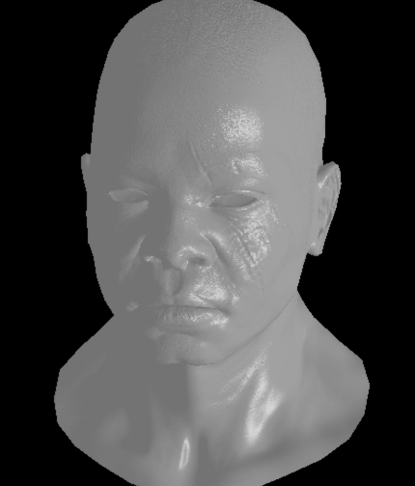
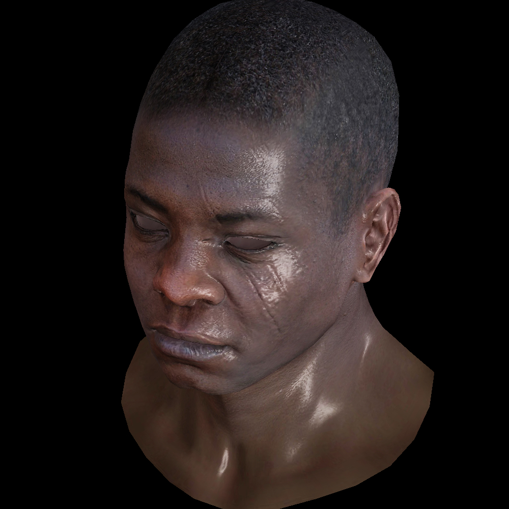

# Rusterizer
This project implements a basic OpenGL rendering pipeline. 
No dependencies were used, writtent entirely in Rust from scratch.
You can try it online here [https://dzharvis.github.io/rusterizer/](https://dzharvis.github.io/rusterizer/)

### Todo
 - [ ] Ambient occlusion
 - [ ] Prettier sanbox ui
 - [ ] Add More different model examples
 - [ ] Use wasm threads for slightly better performance
 