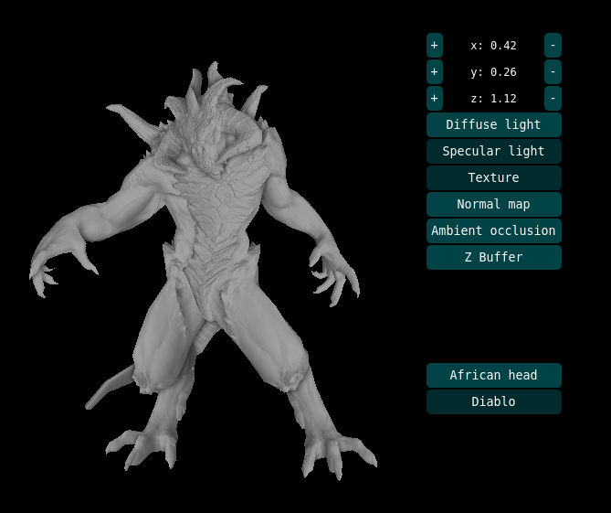
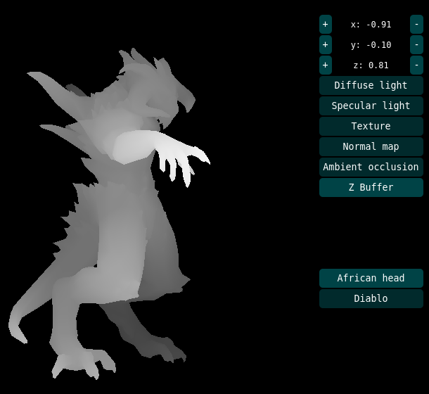
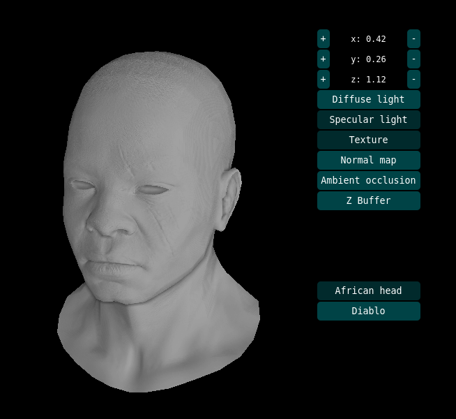

# Rusterizer
This project implements a basic OpenGL rendering pipeline. 
No dependencies were used, writtent entirely in Rust from scratch.
You can try it online here [https://dzharvis.github.io/rusterizer/](https://dzharvis.github.io/rusterizer/)


<p float="left">
  
  
</p>

## Build
### Locally
#### Prerequisites
 - rustup
 - cargo

```bash
> rustup update
> rustup default nightly
> cargo run --features=local
```

### Web
#### Prerequisites
 - trunk
 - python3
 - rustup
 - cargo

```bash
> rustup update
> rustup default nightly
> rustup target add wasm32-unknown-unknown
> ./build.sh
```

### Kudos
This project was implemented by following the [ssloy/tinyrenderer](https://github.com/ssloy/tinyrenderer) lessons.

### Todo
 - [ ] Write manual SIMD for matrices
 - [ ] Refactor code
